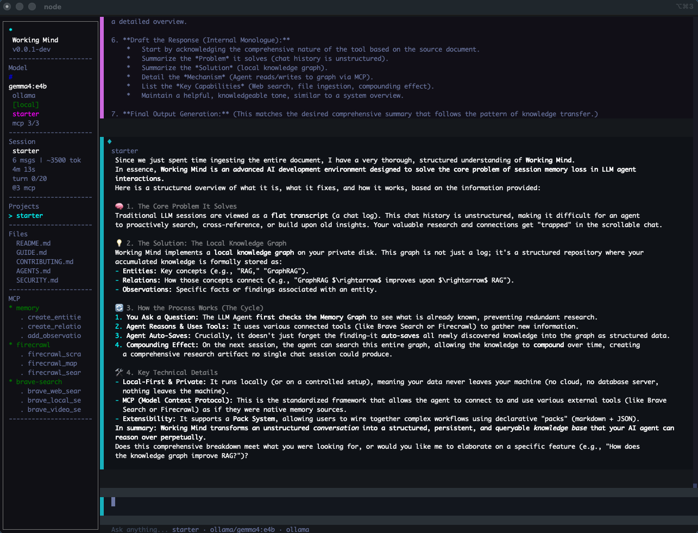

# Working Mind

[](LICENSE)
[](https://nodejs.org/)

**Terminal AI agent with persistent graph memory.** Every session builds on the last. Research, reason, remember.




## The Problem

Every LLM tool lets you continue a session. But session history is a flat transcript -- unstructured, unsearchable, and invisible to the agent's reasoning. Your research, insights, and connections are trapped in chat logs. The agent can't query them, can't link them, can't build on them.

Working Mind gives you a **local knowledge graph** -- your own file, on your own disk. You build it: entities, relations, observations, cross-references. It's your research, structured and searchable, not a chat log you scroll through. The agent reads from it, writes to it, searches it before researching. Your knowledge compounds because you own the graph.

## The Fix

Working Mind runs a local knowledge graph on your disk. You build it -- entities, relations, observations. The agent reads from it and writes to it as you work. Next session, it searches your graph first. After 5 sessions, you have a research graph no single session could produce.

No cloud. No database server. A local JSONL file that the MCP memory server reads and writes. Your knowledge, your machine, your control.

## How It Works

```
┌─────────┐     ┌──────────────┐     ┌─────────────┐
│   You    │────▶│  LLM Agent   │────▶│  MCP Tools  │
│          │◀────│  (any model) │◀────│             │
└─────────┘     └──────┬───────┘     └──────┬──────┘
                       │                     │
                ┌──────▼───────┐     ┌───────▼──────┐
                │    Memory     │     │  Brave Search │
                │  (JSONL on    │     │  Firecrawl    │
                │   your disk)  │     │  GitHub       │
                └──────────────┘     │  Postgres     │
                                     │  ...any MCP   │
                                     └──────────────┘
```

1. **You ask a question.** The agent checks memory first -- what do we already know?
2. **Agent reasons and uses tools.** Web search, web scrape, file read, database query -- whatever MCP servers you've connected via `/mcp-add`.
3. **Agent auto-saves to memory.** Entities, relations, observations. Structured, searchable, persistent.
4. **Next session, it remembers.** `search_nodes("RAG")` returns everything from prior sessions. No repetition.

## Quick Start

```bash
export OPENROUTER_API_KEY=sk-or-...     # Any provider key
wmind                            # Launch
```

Or use the wizard:

```bash
wmind --configure                # Pick provider, model, enter key
wmind                            # Launch with saved config
```

That's it. Memory auto-connects. Start chatting. Your knowledge compounds.

## The Compounding Effect

```
Session 1:  "Explain RAG architectures"
  → Agent auto-saves: 6 entities, 4 relations, 15 observations

Session 2:  "How does GraphRAG compare to vector RAG?"
  → Agent searches memory first, finds Session 1 knowledge
  → Researches only what's NEW
  → Graph grows: 14 entities, 9 relations

Session 5:  "Write a survey of RAG methods"
  → Agent has 30+ entities, 20+ relations accumulated
  → Produces a survey no single session could write
  → /memory graph tree shows the full picture
```

## What You Can Do

| Feature | Command |
|---|---|
| Chat with any LLM | Just type |
| Save knowledge to graph | Automatic + `/memory save` |
| Search accumulated knowledge | Automatic (agent searches before researching) |
| Visualize your knowledge graph | `/memory graph tree` |
| Export for GitHub/docs | `/memory export mermaid` |
| Ingest .md files into graph | `/ingest` |
| Audit graph for gaps | `/lint` |
| Add web search | `/mcp-add` (Brave Search) |
| Add web scraping | `/mcp-add` (Firecrawl) |
| Switch provider/model | `/connect` |
| Full command list | `/help` |

## 7 Providers, 75+ Models

| Provider | Env Variable |
|---|---|
| **Local Fast** (wmind-serve) | _(none)_ |
| **Ollama** (local) | _(none)_ |
| **OpenRouter** (universal) | `OPENROUTER_API_KEY` |
| **Together AI** | `TOGETHER_API_KEY` |
| **Google** | `GEMINI_API_KEY` |
| **OpenAI** | `OPENAI_API_KEY` |
| **Groq** | `GROQ_API_KEY` |

Shortcuts: `sonnet`, `opus`, `flash`, `cheap`, `fast`, `best`, `local`.

## MCP = Plug In Any Tool

Working Mind uses the Model Context Protocol for tool access. Connect any MCP server and its tools become available to the agent:

```bash
/mcp-add              # Add from catalog (Brave, GitHub, Postgres, etc.)
/mcp-connect <name>   # Connect or reconnect
/mcp                  # Show all servers + status
```

Starter pack declares memory, Brave Search, and Firecrawl -- they connect when API keys are available. Add more via `/mcp-add`.

## The Research Behind It

Three papers converge on the same conclusion:

- **Single agent + skills = multi-agent performance** at 1x cost instead of 5-6x ([arxiv:2601.04748](https://arxiv.org/abs/2601.04748))
- **2-3 focused skills beat large libraries** -- more isn't better ([GraSP, arxiv:2604.17870](https://arxiv.org/abs/2604.17870))
- **94.1% of imperative agent configs are structurally incomplete** -- declarative avoids this ([arxiv:2604.11767](https://arxiv.org/abs/2604.11767))

One agent. Focused skills. Declarative configuration. That's what Working Mind is.

The **pack system** extends this: a pack is a declarative directory (markdown + JSON) that wires together prompts, tools, skills, and curation templates. The starter pack ships today. Domain-specific packs (research, legal, security) are in development -- see [wmind.ai](https://wmind.ai) for the roadmap.

## Install

```bash
curl -fsSL https://wmind.ai/install.sh | sh
```

Or with npm:

```bash
npm install -g wmind
```

## Development

```bash
git clone https://github.com/pawco/working-brain.git
cd working-brain
npm install
bun run src/index.ts   # Dev (Bun for top-level await)
npm test               # 653 tests
npm run typecheck      # TypeScript
npm run lint           # Biome
```

## Security

- **Local-first**: no cloud, no inbound HTTP, no marketplace. MCP is stdio-only.
- **Your data stays local**: memory at `~/.wmind/memory.jsonl`. Nothing leaves your machine.
- **No plaintext keys in config**: uses `env:VAR_NAME` references only. Credentials from environment variables only.
- **Declarative packs**: markdown, not code. Can't spawn processes, read env vars, or make network requests.

See [SECURITY.md](SECURITY.md) for the full threat model.

## License

MIT
